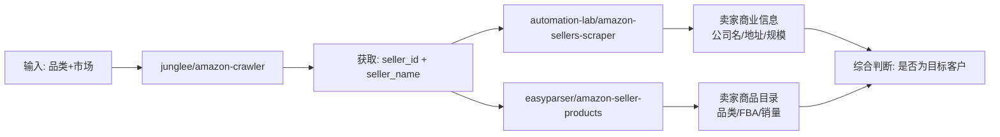

以下是三个 Apify Actor 的详细接口文档，按“品类搜索→卖家画像→商品目录”的获客流程排列。

---

## 一、junglee/amazon-crawler（品类搜索 → 产品信息）

### 功能说明

按品类关键词或URL从亚马逊搜索页面抓取产品信息，返回产品的价格、评分、ASIN、卖家信息等结构化数据。定价 **$3.00 / 1,000 条结果**。

### 入参（Input）

```json
{
  "categoryOrProductUrls": [
    { "url": "https://www.amazon.com/s?k=yoga+mat" }
  ],
  "maxItemsPerStartUrl": 100,
  "maxSearchPagesPerStartUrl": 9999,
  "maxOffers": 0,
  "proxyCountry": "AUTO_SELECT_PROXY_COUNTRY",
  "maxProductVariantsAsSeparateResults": 0,
  "locationDeliverableRoutes": ["PRODUCT", "SEARCH", "OFFERS"]
}
```

| 参数名 | 类型 | 必填 | 说明 |
|--------|------|------|------|
| `categoryOrProductUrls` | 数组 | ✅ | 要爬取的URL列表，支持搜索页(`/s?k=`)、分类页、商品详情页等 |
| `maxItemsPerStartUrl` | 整数 | ❌ | 每个起始URL最多抓取的结果数，默认不限 |
| `maxSearchPagesPerStartUrl` | 整数 | ❌ | 每个起始URL最多爬取的搜索结果页数，默认9999 |
| `maxOffers` | 整数 | ❌ | 每个商品最多抓取的Offer数量，0表示只抓主卖家 |
| `proxyCountry` | 字符串 | ❌ | 代理国家，默认自动选择 |
| `maxProductVariantsAsSeparateResults` | 整数 | ❌ | 变体作为独立结果输出的最大数量，0表示不拆分 |
| `locationDeliverableRoutes` | 数组 | ❌ | 应用配送位置的页面类型，默认全部生效 |

### 返回数据（Output）

| 字段名 | 说明 | 对货代的价值 |
|--------|------|-------------|
| `row_type` | 数据类型（`search_result`/`product_detail`/`offer`） | **区分数据来源** |
| `asin` | 亚马逊商品唯一ID | 商品追踪标识 |
| `title` | 商品名称 | 了解卖家主营产品 |
| `price` | 商品价格 | 判断商品档次 |
| `rating` | 商品评分 | 评估产品口碑 |
| `review_count` | 评论总数 | **衡量销量活跃度** |
| `seller_id` | 卖家唯一ID（Merchant ID） | **后续查询的关键** |
| `seller_name` | 卖家店铺名称 | **识别中国卖家** |
| `country` | 所属亚马逊站点（us/uk/de等） | 明确目标市场 |
| `ships_from` | 发货来源地 | **判断是否中国发货** |
| `is_prime` | 是否支持Prime（FBA） | **判断是否使用FBA** |
| `brand` | 商品品牌 | 反查公司信息 |

---

## 二、automation-lab/amazon-sellers-scraper（卖家ID → 商业信息）

### 功能说明

通过卖家ID或店铺URL，抓取卖家的工商注册信息（公司名、地址）、评分、反馈数、响应时间等。采用按事件付费（Pay per event）模式。

### 入参（Input）

```json
{
  "sellerIds": ["A2L77EE7U53NWQ", "A1B2C3D4E5F6G"],
  "startUrls": [],
  "maxResults": 5,
  "proxyConfiguration": {
    "useApifyProxy": true,
    "apifyProxyGroups": ["RESIDENTIAL"]
  },
  "maxRequestRetries": 3
}
```

| 参数名 | 类型 | 必填 | 说明 |
|--------|------|------|------|
| `sellerIds` | 字符串数组 | 否* | 亚马逊卖家ID列表 |
| `startUrls` | URL数组 | 否* | 卖家资料页或店铺主页完整URL |
| `maxResults` | 整数 | ❌ | 最多抓取的卖家数量，默认5 |
| `proxyConfiguration` | 对象 | ❌ | 代理配置，推荐使用住宅代理 |
| `maxRequestRetries` | 整数 | ❌ | 最大重试次数，默认3 |

> *`sellerIds` 和 `startUrls` 至少提供一个。

### 返回数据（Output）

| 字段名 | 说明 | 对货代的价值 |
|--------|------|-------------|
| `sellerName` | 店铺显示名称 | 识别和筛选卖家 |
| `businessName` | **法定公司全称** | **反查企业背景** |
| `businessAddress` | **法定注册地址** | **判断是否中国公司** |
| `sellerId` | 卖家唯一ID | 持续追踪标识 |
| `profileUrl` | 卖家资料页链接 | 人工核验 |
| `totalFeedback` | 总反馈数量 | **衡量业务规模** |
| `positivePercent` | 好评百分比 | 评估信誉度 |
| `memberSince` | 亚马逊注册时间 | 判断卖家经验 |
| `responseTime` | 平均回复时间 | 评估运营效率 |

输出格式支持JSON、CSV、Excel。

---

## 三、easyparser/amazon-seller-products（卖家ID → 商品目录）

### 功能说明

通过卖家ID或店铺URL，获取该卖家的完整商品目录——ASIN、标题、价格、评分、Prime状态、品牌、类目、库存等。定价 **$3.00/月 + 按量付费**。

### 入参（Input）

```json
{
  "seller_id": "A1H9NXUVFQNAQC",
  "domain": ".com",
  "max_pages": 1,
  "sort_by": "exact-aware-popularity-rank",
  "language": "en_US",
  "api_key": "your_easyparser_api_key"
}
```

| 参数名 | 类型 | 必填 | 说明 |
|--------|------|------|------|
| `seller_id` | 字符串 | 否* | 亚马逊卖家ID |
| `url` | 字符串 | 否* | 卖家店铺完整URL |
| `domain` | 字符串 | ✅ | 目标市场域名（`.com`/`.co.uk`/`.de`等） |
| `max_pages` | 整数 | ❌ | 抓取的商品列表页数（1-5页），默认1 |
| `sort_by` | 字符串 | ❌ | 商品排序方式 |
| `language` | 字符串 | ❌ | 页面语言代码（如`en_US`） |
| `api_key` | 字符串 | ❌ | Easyparser个人API密钥，不填则用共享演示密钥 |

> *`seller_id` 和 `url` 至少提供一个。

### 返回数据（Output）

每行数据对应一个商品：

| 字段名 | 说明 | 对货代的价值 |
|--------|------|-------------|
| `asin` | 亚马逊商品唯一ID | 商品追踪 |
| `title` | 商品全称 | **了解主营产品线** |
| `price` | 当前价格 | 判断商品档次 |
| `rating` | 商品评分 | 评估产品表现 |
| `ratings_total` | 评论总数 | **衡量销量活跃度** |
| `is_prime` | 是否支持Prime（FBA） | **判断是否使用FBA** |
| `brand` | 品牌名称 | 反查公司信息 |
| `categories` | 亚马逊类目 | **分析主营领域** |
| `position` | 在店铺中的排名 | 识别主推商品 |
| `availability` | 库存状态 | 判断是否正常销售 |

元数据行（最后一行）包含 `total_products_returned`（商品总数）、`pages_fetched`（抓取页数）、`refinements`（筛选器信息如库存状态、品类等）。

---

## 三者的协作流程



1. **`junglee/amazon-crawler`**：输入品类关键词（如"yoga mat"）→ 获取一批产品的 `seller_id` 和 `seller_name`
2. **`automation-lab/amazon-sellers-scraper`**：用 `seller_id` → 获取公司名、注册地址（判断是否中国卖家）、总反馈数（判断规模）
3. **`easyparser/amazon-seller-products`**：用 `seller_id` → 获取商品目录（判断是否FBA、主营品类、销量活跃度）