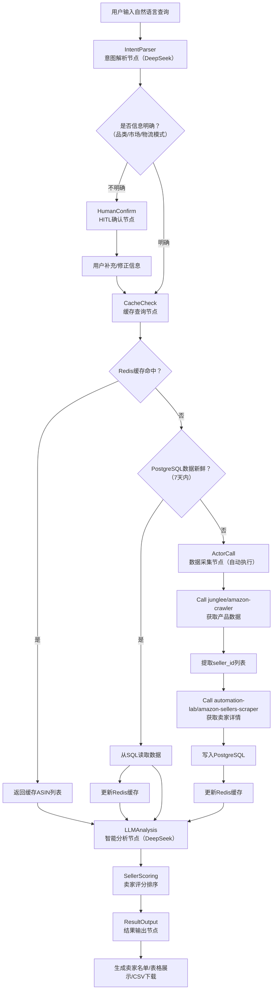

# 面向小型货代的亚马逊卖家智能获取系统——技术解决方案（基于 LangGraph + DeepSeek）

---

## 一、背景

在跨境电商物流行业中，**亚马逊FBA卖家**是货代最核心的客户群体。然而，对于资源有限的小型货代而言，客户获取长期面临以下困境：

1. **客户池模糊**：亚马逊平台拥有数百万活跃卖家，但缺乏有效的筛选工具，货代难以精准定位“正在发货且持续补货”的目标客户。
2. **信息采集成本高**：市面上虽有 `junglee/amazon-crawler`、`automation-lab/amazon-sellers-scraper` 等 Apify Actor 可获取产品与卖家数据，但按量计费的模式导致大规模采集成本高昂。
3. **客户画像缺失**：传统货代依赖人脉和经验获客，缺乏数据驱动的卖家评估能力。
4. **数据孤岛问题**：获取的亚马逊数据缺乏结构化存储与分析，每次查询都需重新采集。

本方案基于 **LangGraph** 构建智能 Agent，通过 **Human-in-the-Loop（HITL）** 机制仅在用户输入信息不明确时请求人工确认，其余流程自动化执行，为小型货代构建一套 **低成本、可积累、智能化** 的亚马逊卖家获取系统。

---

## 二、解决的问题

| 序号 | 问题 | 解决方案 |
| :---: | :--- | :--- |
| 1 | **Actor 调用费用高昂** | Redis 缓存 + PostgreSQL 持久化的二级存储机制，重复查询无需重复调用 Actor |
| 2 | **卖家国籍识别困难** | 通过 `business_address` 字段自动解析国家，精准识别中国卖家 |
| 3 | **客户画像模糊** | DeepSeek LLM 基于品类与市场数据自动推导卖家画像，仅当信息不足时请求用户确认 |
| 4 | **无法评估卖家价值** | 聚合 Feedback 数量、Review 增长率等多维指标，智能排序 |
| 5 | **数据无法复用** | 结构化存储历史数据，支持趋势分析与周期性自动更新 |
| 6 | **用户输入歧义** | 通过 HITL 机制在信息不明确时中断并请求用户澄清，确保查询精准 |
| 7 | **结果查看与导出不便** | 右侧聊天框内展示表格，支持一键下载 CSV |

---

## 三、系统架构流程图



> **说明**：系统中唯一的人工确认环节仅在意图解析后信息不明确时触发，一旦确认无误，后续所有流程（缓存查询、数据采集、分析、输出）均自动完成，无需额外干预。

---

## 四、数据库设计

采用 **PostgreSQL** 作为持久化存储，设计以下核心表：

### 4.1 产品表（`products`）

数据源：`junglee/amazon-crawler`

| 字段名 | 类型 | 约束 | 描述 |
| :--- | :--- | :--- | :--- |
| `asin` | VARCHAR(20) | PRIMARY KEY | 亚马逊商品唯一标识 |
| `title` | TEXT | | 商品标题 |
| `url` | TEXT | | 商品详情页链接 |
| `brand` | VARCHAR(200) | | 品牌 |
| `price_value` | DECIMAL(10,2) | | 当前价格 |
| `price_currency` | VARCHAR(3) | DEFAULT 'USD' | 货币单位 |
| `stars` | DECIMAL(3,2) | | 评分（0-5） |
| `reviews_count` | INTEGER | | 评论总数 |
| `answered_questions` | INTEGER | | 已回答问题数 |
| `bread_crumbs` | TEXT | | 品类层级路径 |
| `thumbnail_image` | TEXT | | 缩略图 URL |
| `in_stock` | BOOLEAN | | 是否有货 |
| `seller_id` | VARCHAR(30) | FOREIGN KEY | 卖家 ID |
| `marketplace` | VARCHAR(50) | INDEX | 站点（如 amazon.com），从用户输入获取 |
| `category` | VARCHAR(200) | INDEX | 品类名称，从用户输入或 bread_crumbs 解析 |
| `fetched_at` | TIMESTAMP | INDEX | 数据采集时间 |

### 4.2 卖家表（`sellers`）

数据源：`automation-lab/amazon-sellers-scraper`

| 字段名 | 类型 | 约束 | 描述 |
| :--- | :--- | :--- | :--- |
| `seller_id` | VARCHAR(30) | PRIMARY KEY | 卖家 ID（如 A2L77EE7U53NWQ） |
| `name` | VARCHAR(200) | | 店铺名称 |
| `profile_url` | TEXT | | 卖家主页链接 |
| `business_name` | VARCHAR(300) | | 公司注册名 |
| `business_address` | TEXT | | 公司注册地址 |
| `business_country` | VARCHAR(50) | INDEX | 从地址解析的国家（如 China/US） |
| `positive_rating_percent` | DECIMAL(5,2) | | 好评率（百分比） |
| `total_feedback` | INTEGER | | 总反馈数 |
| `recent_feedback_12mo` | INTEGER | | 近 12 个月反馈数 |
| `recent_feedback_90d` | INTEGER | | 近 90 天反馈数 |
| `recent_feedback_30d` | INTEGER | | 近 30 天反馈数 |
| `member_since` | VARCHAR(50) | | 注册日期（如 "January 2018"） |
| `response_time` | VARCHAR(50) | | 平均回复时间 |
| `marketplace` | VARCHAR(50) | INDEX | 站点 |
| `seller_score` | INTEGER | | 系统计算的综合评分 |
| `fetched_at` | TIMESTAMP | | 数据采集时间 |

### 4.3 查询日志表（`query_logs`）

| 字段名 | 类型 | 描述 |
| :--- | :--- | :--- |
| `id` | BIGSERIAL PRIMARY KEY | 自增主键 |
| `user_query` | TEXT | 用户原始输入 |
| `parsed_marketplace` | VARCHAR(50) | 解析出的市场 |
| `parsed_category` | VARCHAR(200) | 解析出的品类 |
| `result_count` | INTEGER | 返回卖家数量 |
| `cache_hit` | BOOLEAN | 是否命中缓存 |
| `actor_cost` | DECIMAL(10,4) | Actor 调用费用（估算） |
| `created_at` | TIMESTAMP | 查询时间 |

---

## 五、技术选型

| 层级 | 技术组件 | 选型理由 |
| :--- | :--- | :--- |
| **Agent 框架** | **LangGraph** | 原生支持状态管理、Checkpointer 持久化、Human-in-the-Loop 中断机制 |
| **编程语言** | Python 3.10+ | 生态丰富，LangGraph 与 Apify SDK 原生支持 |
| **Web 框架** | FastAPI | 轻量、异步支持、自动生成 API 文档 |
| **前端框架** | React 18 + TypeScript | 组件化开发，支持流式响应与动态表格渲染 |
| **LLM 引擎** | **DeepSeek API**（deepseek-chat 模型） | 性价比高，支持中英文，适合意图解析与卖家分析 |
| **数据采集** | `langchain-apify` + ApifyClient | 官方集成，无缝调用 Apify Actors |
| **缓存层** | Redis 7.0+ | 内存级高速读写，支持分布式缓存 |
| **持久化存储** | PostgreSQL 15+ | 复杂查询、事务支持、作为 LangGraph Checkpointer 后端 |
| **ORM** | SQLAlchemy 2.0 | 对象关系映射，方便表操作与迁移 |
| **Checkpointer** | `langgraph-checkpoint-postgres` | LangGraph 状态持久化，支持 HITL 中断恢复 |
| **CSV 导出** | `papaparse`（前端） / `pandas`（后端） | 前端支持浏览器端 CSV 生成，后端兜底 |
| **部署方式** | Docker + Docker Compose | 服务容器化，便于私有化部署 |

---

## 六、LangGraph Agent 设计与 Human-in-the-Loop 实现

### 6.1 Agent 状态定义

```python
from typing import TypedDict, List, Optional

class AgentState(TypedDict):
    # 用户输入
    user_query: str
    # 解析结果
    marketplace: Optional[str]
    category: Optional[str]
    shipping_type: Optional[str]   # sea / air
    service_mode: Optional[str]    # FBA / FBM
    # 数据状态
    products: List[dict]
    sellers: List[dict]
    # 流程控制
    need_human_confirm: bool       # 是否需要用户补充信息
    human_approved: bool           # 用户是否确认/补充
    # 分析结果
    scored_sellers: List[dict]
    final_result: dict
```

### 6.2 节点设计

#### 节点1：意图解析（`parse_intent`）

使用 DeepSeek LLM 解析用户自然语言输入，提取 `marketplace`、`category`、`shipping_type`、`service_mode` 等关键信息。同时评估信息完整度，若缺失必要字段（如品类或市场），则标记 `need_human_confirm = True`。

#### 节点2：HITL 确认（`human_confirm`）

当解析结果缺失必要信息时，通过 `interrupt()` 函数暂停执行，向用户请求补充：

```python
from langgraph.types import interrupt

def human_confirm_node(state: AgentState) -> dict:
    if not state.get("need_human_confirm"):
        return {"human_approved": True}
    
    # 构建澄清问题
    missing = []
    if not state.get("marketplace"):
        missing.append("目标市场（如 amazon.com）")
    if not state.get("category"):
        missing.append("产品品类（如 outdoor furniture）")
    
    question = f"请补充以下信息：{', '.join(missing)}"
    response = interrupt({
        "question": question,
        "current_parsed": {
            "marketplace": state.get("marketplace"),
            "category": state.get("category")
        }
    })
    return {
        "marketplace": response.get("marketplace") or state.get("marketplace"),
        "category": response.get("category") or state.get("category"),
        "human_approved": True
    }
```

#### 节点3：缓存检查（`check_cache`）

优先查 Redis，若无则查 PostgreSQL 判断数据新鲜度（7 天内）。若数据新鲜则直接从 SQL 读取并更新 Redis；若过期或不存在则进入采集流程。

#### 节点4：数据采集（`call_actors`）

**自动执行，无需用户确认。** 调用 Apify Actors：

```python
from langchain_apify import ApifyActorsTool

product_tool = ApifyActorsTool("junglee/amazon-crawler")
seller_tool = ApifyActorsTool("automation-lab/amazon-sellers-scraper")
```

采集完成后将数据写入 PostgreSQL 并更新 Redis 缓存。

#### 节点5：智能分析（`llm_analysis`）

使用 DeepSeek LLM 对 sellers 数据进行综合分析，生成每个卖家的画像描述和评分依据。分析维度包括：

- 卖家体量（total_feedback）
- 近期活跃度（recent_feedback_30d）
- 国籍（business_country）
- 服务时效（response_time）
- 产品评分与评论趋势

#### 节点6：评分排序（`score_sellers`）

根据上述维度计算综合评分（0-100），并按评分降序排列。

#### 节点7：结果输出（`output_result`）

生成最终卖家名单，以结构化 JSON 返回，供前端渲染表格。

### 6.3 Graph 编排

```python
from langgraph.graph import StateGraph, START, END
from langgraph.checkpoint.postgres import PostgresSaver

builder = StateGraph(AgentState)

builder.add_node("parse_intent", parse_intent)
builder.add_node("human_confirm", human_confirm_node)
builder.add_node("check_cache", check_cache)
builder.add_node("call_actors", call_actors)
builder.add_node("llm_analysis", llm_analysis)
builder.add_node("score_sellers", score_sellers)
builder.add_node("output_result", output_result)

builder.add_edge(START, "parse_intent")
builder.add_edge("parse_intent", "human_confirm")
builder.add_conditional_edges("human_confirm", 
    lambda s: "check_cache" if s["human_approved"] else END)
builder.add_edge("check_cache", "call_actors")  # 直接调用，无需确认
builder.add_edge("call_actors", "llm_analysis")
builder.add_edge("llm_analysis", "score_sellers")
builder.add_edge("score_sellers", "output_result")
builder.add_edge("output_result", END)

checkpointer = PostgresSaver.from_conn_string("postgresql://...")
graph = builder.compile(checkpointer=checkpointer)
```

---

## 七、用户使用流程与界面设计

### 7.1 整体界面布局

采用 **左会话 + 右聊天** 的双栏布局，符合对话式交互习惯：

```
┌──────────────────────────────────────────────────────────────────────────────┐
│  🤖 亚马逊卖家智能获取助手                                   [用户头像]   │
│  ─────────────────────────────────────────────────────────────────────────── │
│ ┌───────────┬──────────────────────────────────────────────────────────────┐│
│ │  📋 会话   │  💬 对话区域                                               ││
│ │  列表      │  ┌────────────────────────────────────────────────────────┐ ││
│ │            │  │  👤 我：我想找美国站卖户外家具的FBA卖家              │ ││
│ │  ────────  │  ├────────────────────────────────────────────────────────┤ ││
│ │  🔍 搜索   │  │  🤖 助手：好的，正在为您分析...                      │ ││
│ │            │  │  ⏸️ 需要您补充信息：                                   │ ││
│ │  ⭐ 收藏夹  │  │  请明确品类：户外家具下的具体子类？                   │ ││
│ │            │  │  [输入框]  [提交]                                     │ ││
│ │  会话1     │  ├────────────────────────────────────────────────────────┤ ││
│ │  户外家具  │  │  ✅ 分析完成！共找到 47 个相关卖家，Top 10：         │ ││
│ │  2026-01-15│  │  ┌────┬────────┬────────┬───────┬────────┬─────────┐│ ││
│ │  会话2     │  │  │ #  │ 卖家名 │ 地址   │Feedback│ 主营   │ 补货状态││ ││
│ │  健身器材  │  │  ├────┼────────┼────────┼───────┼────────┼─────────┤│ ││
│ │  2026-01-14│  │  │ 1  │SunnyH..│深圳,CN │ 1,234 │ 沙发   │ 🔴紧急  ││ ││
│ │  会话3     │  │  │ 2  │Garden..│广州,CN │  856  │ 桌椅   │ 🟡中等  ││ ││
│ │  宠物用品  │  │  │ 3  │PatioL..│厦门,CN │ 2,101 │ 吊床   │ 🔴紧急  ││ ││
│ │  2026-01-13│  │  └────┴────────┴────────┴───────┴────────┴─────────┘│ ││
│ │            │  │  [📥 下载CSV]  [🔄 重新分析]  [⭐ 保存会话]          │ ││
│ │            │  └────────────────────────────────────────────────────────┘ ││
│ │            │  输入框：[                      ] [发送]                   ││
│ └───────────┴──────────────────────────────────────────────────────────────┘│
└──────────────────────────────────────────────────────────────────────────────┘
```

### 7.2 界面组件说明

| 区域 | 组件 | 功能描述 |
| :--- | :--- | :--- |
| **左侧栏** | 会话列表 | 显示历史查询会话，按时间倒序排列，支持点击切换 |
| | 搜索框 | 支持按关键词搜索历史会话 |
| | 收藏夹 | 保存常用查询条件，一键复用 |
| **右侧聊天框** | 消息区 | 展示用户输入与 Agent 回复，支持 Markdown 渲染 |
| | 表格组件 | 在消息中嵌入卖家数据表格，支持排序与分页 |
| | 下载按钮 | 点击后前端直接生成 CSV 下载，不经过后端（减少压力） |
| | 输入区 | 支持多行文本输入，Enter 发送，Shift+Enter 换行 |

### 7.3 CSV 导出实现方案

采用 **前端直接生成 CSV** 的方式，无需后端参与：

```typescript
// 使用 papaparse 库
import Papa from 'papaparse';

const exportToCSV = (data: Seller[], filename: string = 'sellers.csv') => {
    // 映射为表格列
    const rows = data.map(seller => ({
        '卖家ID': seller.seller_id,
        '店铺名称': seller.name,
        '公司名称': seller.business_name,
        '公司地址': seller.business_address,
        '国家': seller.business_country,
        '好评率': `${seller.positive_rating_percent}%`,
        '总反馈数': seller.total_feedback,
        '近30天反馈': seller.recent_feedback_30d,
        '注册时间': seller.member_since,
        '综合评分': seller.seller_score
    }));
    
    const csv = Papa.unparse(rows, {
        quotes: true,           // 字段加引号防止逗号问题
        delimiter: ',',
        header: true
    });
    
    // 添加 BOM 支持 Excel 打开 UTF-8
    const blob = new Blob(['\uFEFF' + csv], { type: 'text/csv;charset=utf-8;' });
    const link = document.createElement('a');
    link.href = URL.createObjectURL(blob);
    link.download = filename;
    link.click();
    URL.revokeObjectURL(link.href);
};
```

### 7.4 典型使用流程

```
步骤1：用户登录，进入主界面
    └── 左侧展示历史会话列表，右侧为空白聊天区

步骤2：输入查询需求（自然语言）
    └── 示例："我想找美国站卖户外家具的FBA卖家"

步骤3：若信息不全，Agent 中断并请求补充
    ├── 显示 "需要您补充信息" 消息
    ├── 用户补充后提交
    └── Agent 继续执行

步骤4：Agent 自动处理（无需额外确认）
    ├── [缓存检查] → 命中则直接分析
    ├── [数据采集] → 自动调用 Actor（如有需要）
    ├── [智能分析] → DeepSeek 筛选排序
    └── [结果输出] → 在聊天框中渲染表格

步骤5：查看与导出
    ├── 在聊天框内直接浏览卖家列表
    ├── 点击 [下载CSV] 按钮一键导出
    └── 点击 [保存会话] 将本次查询保存到左侧列表
```

---

## 八、成本优化策略

| 优化点 | 方案 | 预期效果 |
| :--- | :--- | :--- |
| **减少 Actor 调用** | Redis 缓存 + SQL 新鲜度检查（7 天有效） | 降低 70-90% 的 Actor 费用 |
| **批量采集** | 一次 Actor 调用获取完整品类数据（非逐条） | 减少请求次数 |
| **冷热数据分离** | 高频品类存 Redis，低频品类只存 SQL | 内存成本可控 |
| **定时刷新** | 仅对用户关注的品类设置定时刷新（APScheduler） | 避免无效采集 |
| **LLM 按需调用** | 仅当 SQL 数据存在时才调用 DeepSeek 分析 | 降低 LLM API 费用 |
| **前端 CSV 导出** | 不经过后端，浏览器端直接生成 | 节省服务器带宽与计算资源 |
| **无需人工确认 Actor 调用** | 移除费用确认节点，减少用户交互成本 | 提升自动化流畅度 |

---

## 九、API 接口设计

| 接口 | 方法 | 功能 | 请求体 | 响应 |
| :--- | :--- | :--- | :--- | :--- |
| `/api/chat/stream` | POST | 流式对话（SSE） | `{ "query": string, "thread_id": string }` | Server-Sent Events |
| `/api/chat/resume` | POST | 恢复中断的会话（HITL） | `{ "thread_id": string, "response": object }` | `{ "status": "success" }` |
| `/api/history/list` | GET | 获取历史会话列表 | `{ "limit": 20, "offset": 0 }` | `{ "sessions": [...] }` |
| `/api/history/{thread_id}` | GET | 获取某次会话详情 | — | `{ "messages": [...], "result": [...] }` |
| `/api/category/suggest` | GET | 品类自动补全（辅助输入） | `{ "keyword": string }` | `["outdoor furniture", ...]` |

---

## 十、总结

本方案基于 **LangGraph** + **DeepSeek** 构建了一套面向小型货代的亚马逊卖家智能获取系统，核心特点包括：

1. **智能编排**：LangGraph 状态图管理全流程，支持复杂的条件分支与状态持久化
2. **人机协同**：仅在用户输入信息不明确时通过 HITL 机制请求补充，其余流程全自动运行
3. **降本增效**：Redis + PostgreSQL 二级缓存将 Actor 调用次数降低 70% 以上
4. **数据积累**：结构化存储历史数据，支持趋势分析与卖家成长追踪
5. **交互友好**：左会话 + 右聊天的双栏布局，表格内嵌展示，一键导出 CSV
6. **成本可控**：采用 DeepSeek 作为 LLM 引擎，前端生成 CSV 减少服务器开销

下一步可按此方案进行 MVP 开发，优先实现“意图解析 → HITL确认 → 缓存查询 → 数据采集 → 智能分析 → 结果展示/导出”的核心流程，后续可扩展 CRM 跟进、邮件自动化触达等模块。